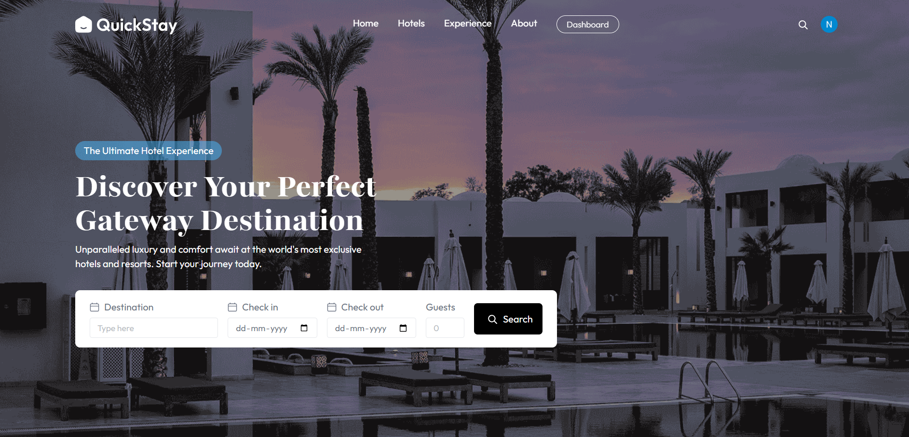
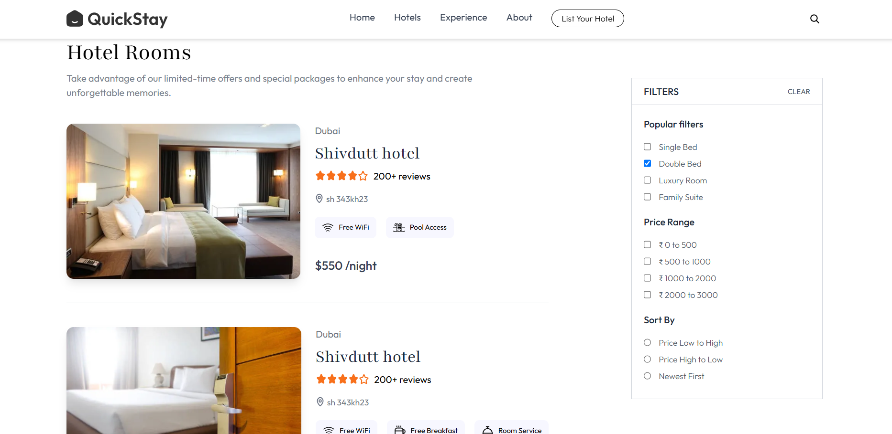
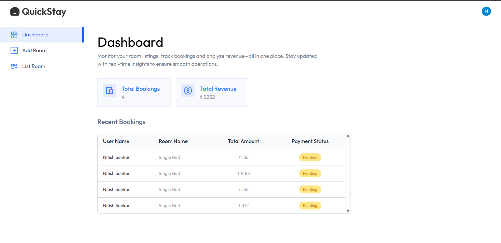

# QuickStay – Full Stack Hotel Booking Platform

QuickStay is a modern hotel booking platform built with React, Vite, Express, MongoDB, Clerk, and Stripe. It allows users to search, book, and manage hotel rooms, while hotel owners can list and manage their properties.

## Features

- **User Authentication:** Secure login and registration using Clerk.
- **Hotel Search & Filter:** Search hotels by city, filter by amenities, price, and room type.
- **Room Booking:** Book rooms, select dates, and manage bookings.
- **Stripe Payments:** Integrated online payment for bookings.
- **Hotel Owner Dashboard:** Owners can register hotels, add rooms, and view bookings.
- **Email Notifications:** Booking confirmations sent via email.
- **Image Uploads:** Cloudinary integration for room images.
- **Recent Searches:** Stores up to 3 recent searched cities for personalized recommendations.

## Screenshots

### Home Page

### Room Details

### Owner Dashboard

## Getting Started

1. **Clone the repository**
2. **Install dependencies** for both `client` and `server` folders.
3. **Set up environment variables** as per `.env.example`.
4. **Run the development server**:
    - Client: `npm run dev`
    - Server: `npm run server`

## Technologies Used

- React, Vite, TailwindCSS
- Express, MongoDB, Mongoose
- Clerk (Authentication)
- Stripe (Payments)
- Cloudinary (Image uploads)

